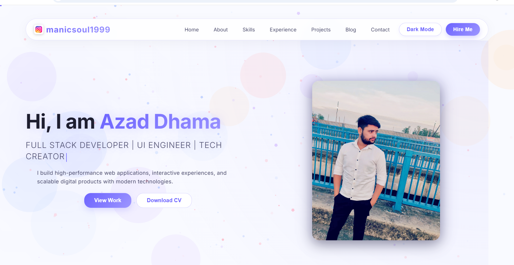
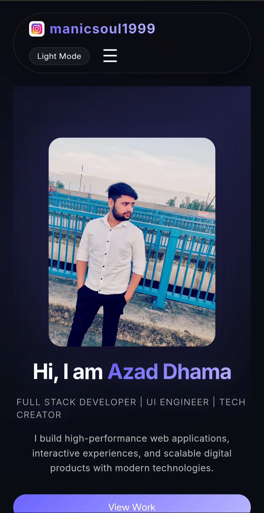

# 💼 ManicSoul Portfolio

A modern, high-performance developer portfolio built with clean UI, smooth animations, and full responsiveness across all devices.

## 🖥️ Preview

### Desktop

### Mobile

## ✨ Features

* Fully Responsive Design
* Smooth Scrolling Experience
* Animated UI Components
* Glassmorphism Cards & Modern Layout
* Interactive Project Section
* Dark / Light Theme Support
* Optimized Performance & UX

## 🛠️ Tech Stack

* HTML5
* CSS3 (Advanced UI & Responsive Design)
* JavaScript (Vanilla)
* GSAP (Animations)
* ScrollTrigger
* tsparticles

## 🚀 Getting Started

1. Clone the repository
2. Open the project folder
3. Run with Live Server or open `index.html` in your browser

## 👨‍💻 Author

**Azad Dhama**
Frontend Developer & UI Engineer

GitHub: https://github.com/golu-dhama
